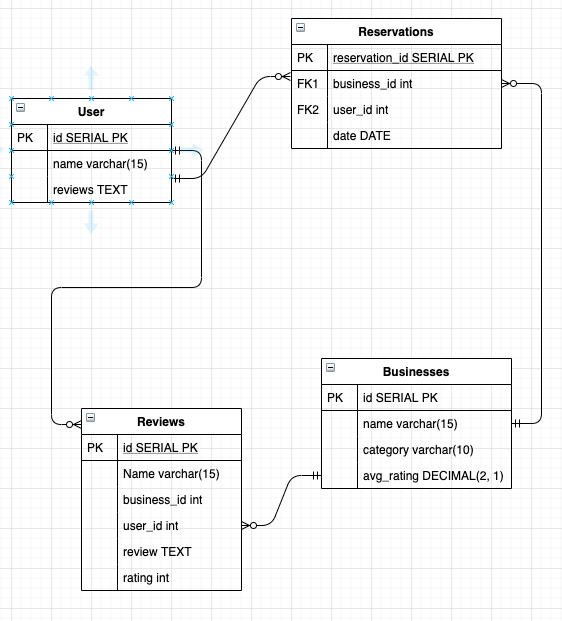

# YELP ERD
     # Entities: Business, User, Review, & Reservation
     
     
     
     
     
-- **Businesses**
> Can have zero or many users, reviews, and reservations.
> One-To-Many relationship with all of users, reviews, and reservations.

-- **Users**
> Can have zero or many reviews, and reservations.
> One-To-Many relationship with reviews, and reservations.
> Has no direct relation to businesses.

-- **Reviews**
> Has one user and one business.
> One-To-One relationship with both users, and businesses.
> Has no direct relation to Reservations.

-- **Reservation**
> Has one or manys users, and one business.
> One-To-One relationship businesses.
> One-To-Many realtionship with users.
> Has no direct relation to Reviews.
