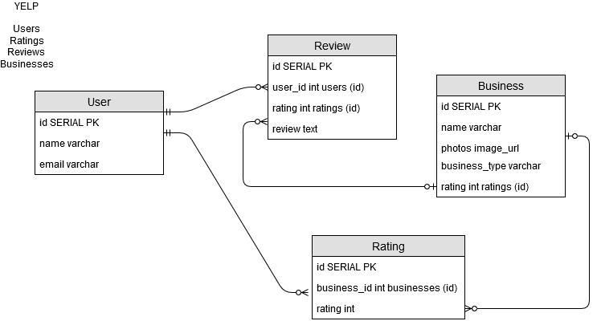

The entities I chose from Yelp are users, businesses, ratings, and reviews, as these are the core entities that you'll come across
when you visit the website. For users, in relation to reviews and ratings, one user can have many ratings and reviews. Ratings and
reviews can only belong to one user. This shows a one to many relationship for users, reviews and ratings. 
For businesses, in relation to reviews and ratings, one business can have many reviews and ratings, 
but the ratings and reviews belong to one business. This also shows a one to many relationship for businesses, reviews and ratings.