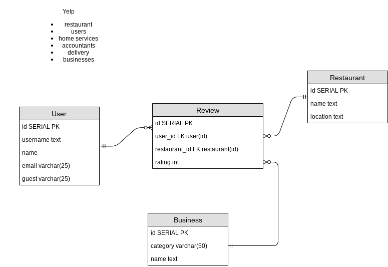

The four entities I decided to pick are **Users**, **Review**, **Restaurant**, and **Business**. A user can make zero or many reviews , but every review can only have one user so this is a **One to Many** relationship. A restaurant can have zero or more reviews but there may only be one review associated with a user on the restaurant. This is also a **One to Many** relationship. A business can have zero or more reviews but there may only be only one review associated with a user on the business, which also makes this a **One to Many** relationship. In this diagram I believe the entity **Review** is the **Cross Reference Table** acting as reference to all of our other entities.
