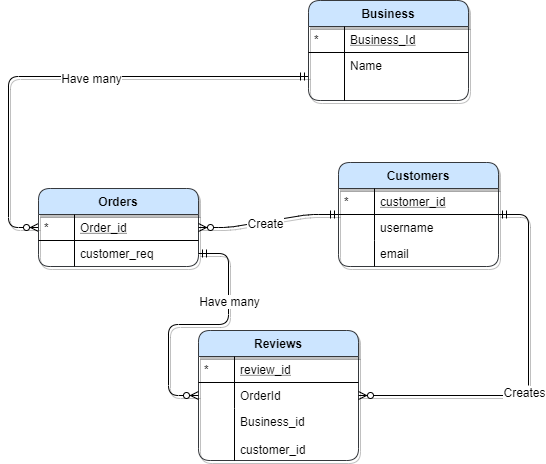

# Yelp Crow's Feet Notation
## Entity Relationship Modeling

### Diagram

### Description

**Entities Chosen:**

* Business
* Customer
* Orders
* Reviews

**As the model above shows:**
* One `Business` can have many `Orders`, or they can have none if they're new or they make bad food
* Many `Orders` can be created by one `Customer`, if they have the bread and want the butter
* Many `Reviews` are created by exactly one `Customer` for each order, if the food is great... or horrible
* Many `Orders` have many `Reviews`, so that the next `Customer` does't have to suffer

## In A Nutshell

Businesses can have many orders to fulfill. Each order is created by one hungry customer, but one customer can create many orders. Each order also has many reviews from different (possibly angry) customers that reflect on the business. Each review is created by one customer, but one customer can create many reviews (if the food didn't kill them).

