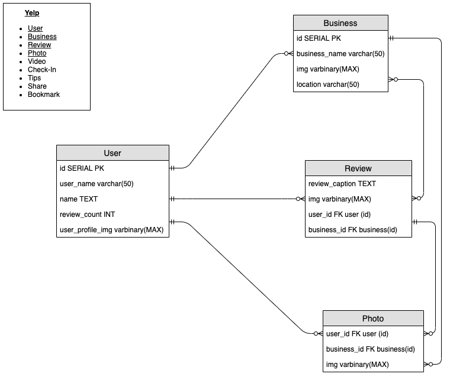

A user is able to add reviews and photos on to the profile of a businesses on yelp. This review populates their own profile with reviews they have given and the business profile of reviews that have been received. Businesses are in able to reply to users reviews.

A user has an ability to view, review, and follow many businesses.
A user has an ability to write multiple reviews of a business and review multiple other businesses one at a time. A business can have zero to many reviews. A user and a business are able to upload zero to many photos and a user is able to upload 0 to many photos on a review.
One review is able have many photos.
