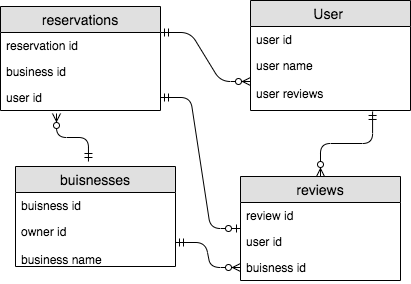

**Yelp ERD**

- businesses
 - **one to many** relationship with reviews and reservations because there can be many reviews and reservations for a business but each one belongs to a single business.
- users
  - **one to many** relationship with reviews and reservations because there can be many reviews and reservations but each one belongs to a single user. Users can also make many reservations and reviews.

- reviews
  - **one to many** relationship with users, because users can post many reviews and a single review belongs to one user.
  - **one to many** relationship with businesses, because businesses can have many reviews and a single review belongs to one business.
  - **one to one** relationship with reservations, because a review can belong only belong to one reservation

- reservations
  - **one to many** relationship with users, because users can make multiple reservations, but a single reservation belongs to a single users
  - **one to many** relationship with businesses, because businesses can have many reservations and a single reservation belongs to one business.
